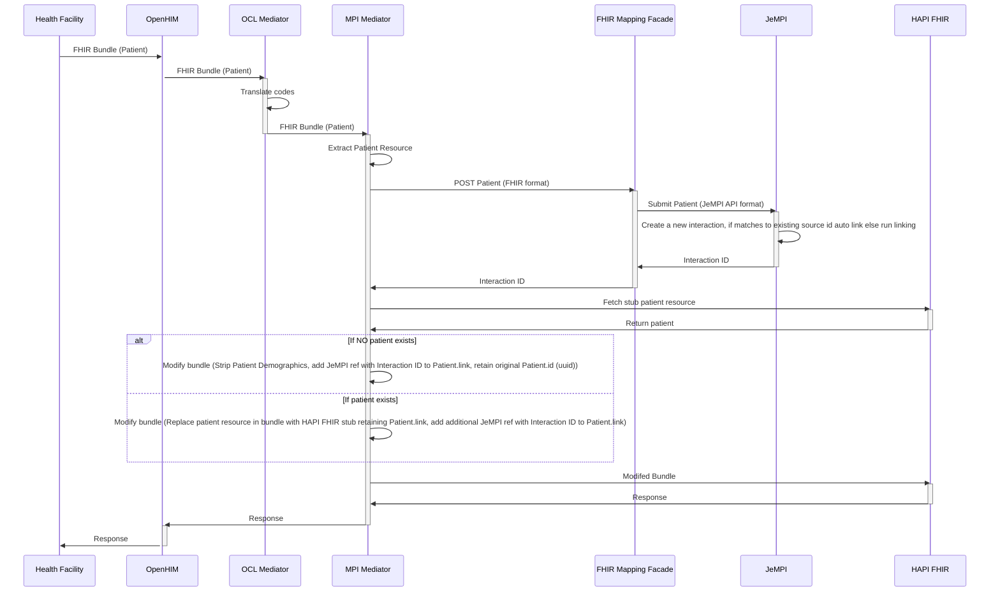

# Architecture

OpenHIM Platform builds on Instant OpenHIE v2 as the deployment tool which provides the concepts of packages, profiles and the CLI utility that powers the ability to launch OpenHIM Platform packages and recipes. Please read the the [Instant OpenHIE Architecture](https://app.gitbook.com/s/TwrbQZir3ZdvejunAFia/concepts/architecture) for some foundational concepts about how packages are run.

On this page we will discuss the architecture of OpenHIM Platform which is a set of packages and recipes that use those packages that create a fully functional HIE from scratch.

## Modularity and flexibility

OpenHIM Platform packages are able to stood up individually so that as much or as little of the package set that is necessary from an implementer can be utilised. However, OpenHIM Platform is designed with some key features that will only be available if a number of packages are setup together. Recipes group those sets of packages together so that it is easier to deploy all at once.

## Component Architecture

<figure><figcaption>
OpenHIM Platform Architecture
</figcaption></figure>

The architecture is split into 3 distinct parts:

* Client: This section represents client systems that might want to interact with the HIE, they have a particular set of interactions that the core OpenHIM Platform packages enable support for.
* Platform core: These are a set of packages with instantiate applications and mediators that enable the core client workflows to be executed. This includes accepting FHIR bundles, splitting patient demographic data into an MPI and clinical data into a FHIR data store as well as managing the linkage from patient demographics to clinical data in a way that isn't affected by potencial linking and unlinking of patient records via the MPI. More on this later.
* Platform pluggable services: by design, once the core packages have processed FHIR request, they are pushed into Kafka for secondary use by other systems. Typically this includes data analytics pipelines and a default implementation is included in OpenHIM Platform, however, the data can be read an used for any purpose i.e. syncing to another HIE or sent to a national data warehouse.

## Platform core wokflow

This is how the core packages interact to split the data into two separate stores, a clinical data store and a patient demographics store.

The reason for doing this are as follows:

* With the clinical and patient demographic data split it is easier to link and unlink patient identities as no data in the clinical store needs to change. They continue to reference the source patient ID and whatever happen to that patient, whether they are grouped together with other identities in the MPI or not, that ID remains constant.
* The split of data is a useful security feature as the clinical data and the Personal Identifiable Information (PII) or stored separately. An attacker would need to compromise both to relate clinical information to a particular person.
* It prevent duplicate information being stored in multiple places, a clear source of truth for each type of information is identified. This prevent data from getting out of sync when it is stored in multiple places.
