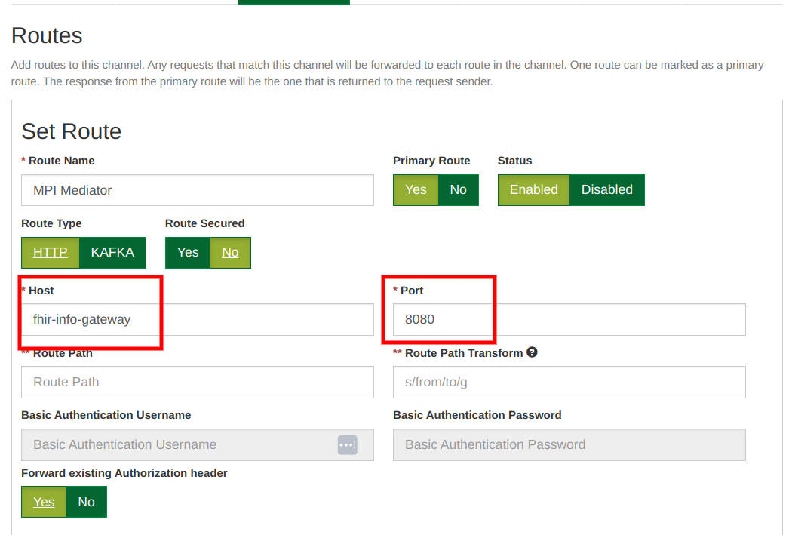
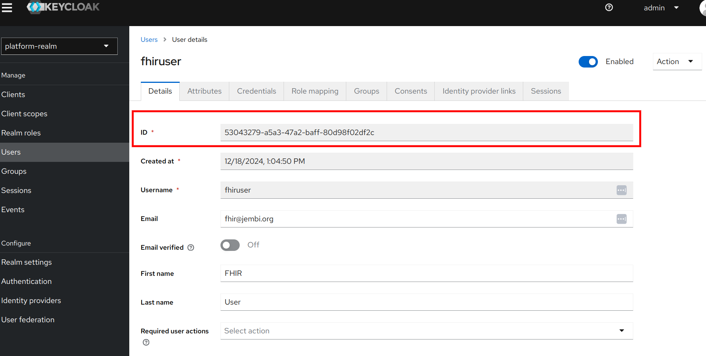
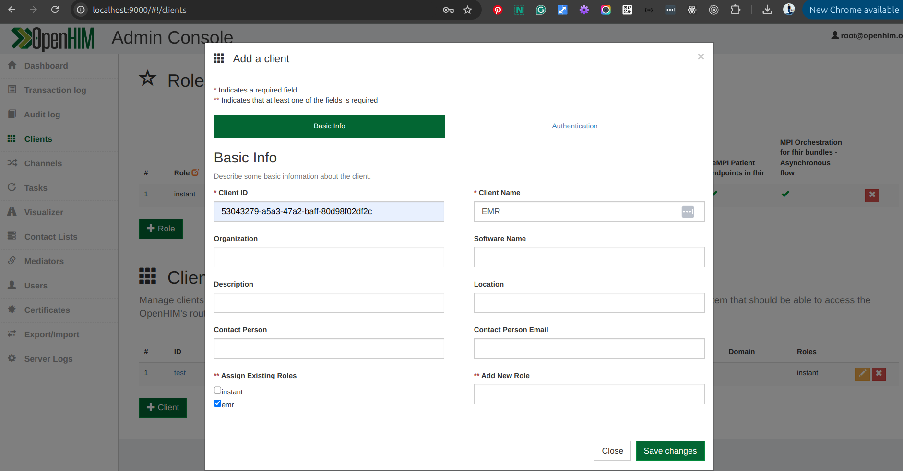
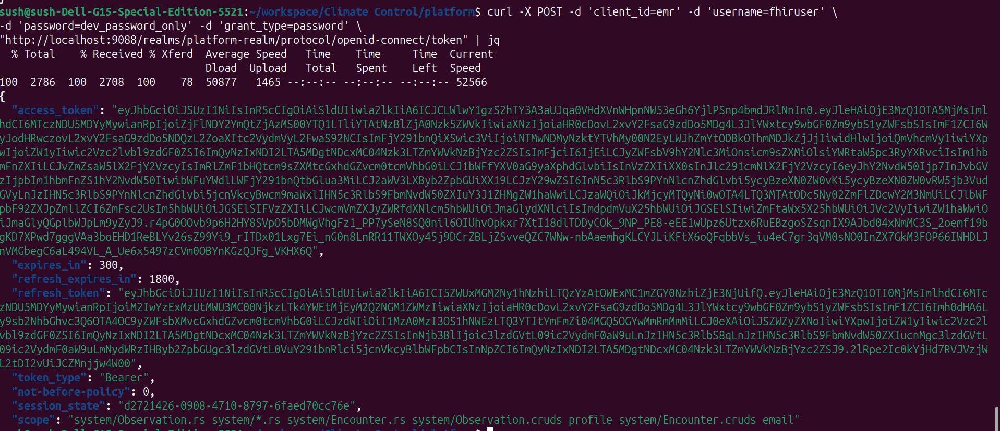

# Table of Contents

- [Overview](#overview)
- [System Configuration](#system-configuration)
- [Routing FHIR Requests](#routing-fhir-requests)
- [Authentication Setup](#authentication-setup)
- [Client Role Management](#client-role-management)
- [API Testing](#api-testing)
- [References](#references)

---

## Overview

This document outlines the setup and integration of the FHIR Info Gateway to enhance the handling of FHIR-based requests. The system leverages OpenHIM for routing, Keycloak for authentication, and custom configurations for managing client access and secure data exchange. This setup enables seamless orchestration of Create/Read operations for patient clinical data.

---

## System Configuration

### Prerequisite Setup

- **Keycloak Integration**: Keycloak is configured as the primary access token provider.
- **Initialization**: Use the following command to initialize the FHIR Info Gateway package:

  ```bash
  ./instant-linux package init -n fhir-info-gateway --dev
  ```

### Default Environment Variables

| Variable           | Description                             | Example Value               |
| ------------------ | --------------------------------------- | --------------------------- |
| `ACCESS_CHECKER`   | Enables role-based scope checking       | `scope`                     |
| `REALM_URL`        | Keycloak realm URL for token generation | `http://localhost:9088`     |
| `GATEWAY_ENDPOINT` | Endpoint for FHIR Info Gateway API      | `http://localhost:8080/api` |

---

## Routing FHIR Requests

### Updating OpenHIM Channels

1. Navigate to the OpenHIM console.
2. Update the MPI Channel settings:
   - **Channel Name**: MPI Orchestrations
   - Ensure all Create/Read requests are routed through the FHIR Info Gateway.

#### Route Configuration Example

<!-- _Add configuration details here._ -->



## Authentication Setup

### Retrieve the User UUID

The User UUID is the Keycloak user UUID. Obtain this UUID by querying Keycloak or checking the admin console.



### Create a New Client in OpenHIM

1. Use the retrieved Keycloak User UUID as the Client ID.
2. Create a new client in OpenHIM using this UUID.



### Generating Client Credentials

Run the following command to generate an access token:

```bash
curl -X POST -d 'client_id=emr' -d 'username=fhiruser' \
-d 'password=dev_password_only' -d 'grant_type=password' \
"http://localhost:9088/realms/platform-realm/protocol/openid-connect/token" | jq
```

Replace `localhost:9088` with the appropriate Keycloak server address.



### Token Usage

Include the generated token in the Authorization header of API requests:

- **In Postman or similar tools**:
  - Use the Bearer Token in the Authorization tab.
  - Add the token generated in the above step.

---

## Client Role Management

### Restricting Client Access

1. Open Keycloak Admin Console.
2. Navigate to the **Client Scopes** section for the FHIR resource.
3. Update roles and permissions to enforce restricted access.

### Disabling Authentication (Development Only)

- Allow anonymous access via Keycloak settings.
- Update the OpenHIM channel to bypass authentication temporarily.

---

## API Testing

### Testing FHIR Requests

- Use tools like Postman or cURL.
- Add the Bearer token to the Authorization header.

#### Example Request

```bash
curl -X GET \
-H "Authorization: Bearer <token>" \
"http://localhost:5001/fhir/Encounter"
```

### Verifying Responses

- Ensure that responses comply with FHIR standards and contain the required patient data.

---

## References

- **GitHub Pull Request**: FHIR Info Gateway Integration
- **Documentation Commands**:

  ```bash
  ./instant-linux package init -n fhir-info-gateway --dev

  ```
